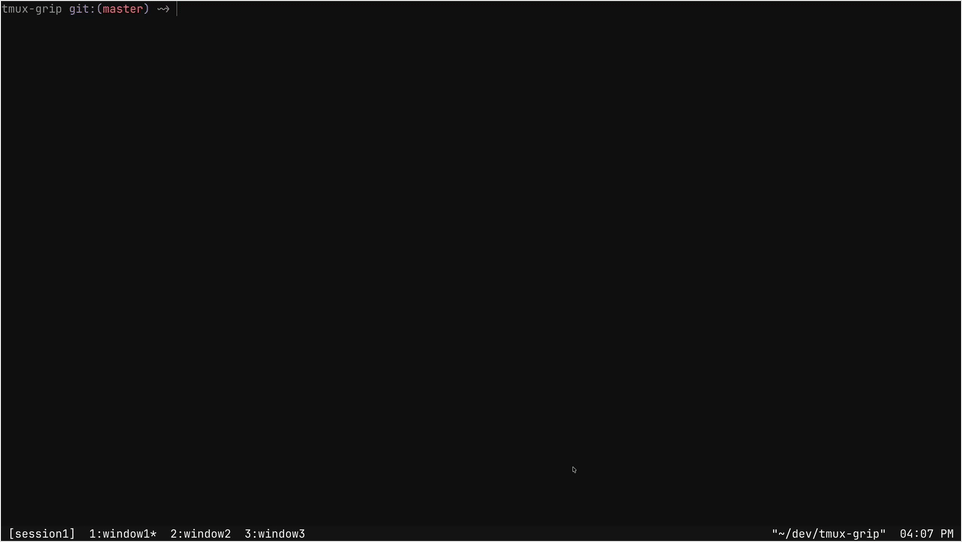

<h1 align="center"><code>tmux-grip</code></h1>

<p align="center">
  <a href="https://github.com/leohenon/tmux-grip/actions/workflows/ci.yml"></a>
  <a href="LICENSE"></a>
  <a href="https://github.com/tmux/tmux"></a>
  <a href="https://github.com/leohenon/tmux-grip/tags"></a>
</p>

<p align="center">
  A tmux plugin inspired by <code>harpoon.nvim</code> that pins sessions into numbered slots for key-based jumps and fast cycling via a lightweight simple popup.
</p>



## Quick Start

- `prefix + G`: add current session to grip
- `prefix + g`: open the grip viewer
- Optional direct slot keys: `prefix + h/j/k/l`

## Install (TPM)

In your `tmux.conf`

```tmux
set -g @plugin 'tmux-plugins/tpm'
set -g @plugin 'leohenon/tmux-grip'

run '~/.tmux/plugins/tpm/tpm'
```

Reload tmux and press `prefix + I` to install plugins.

## Install (Manual)

```bash
git clone https://github.com/leohenon/tmux-grip ~/.tmux/plugins/tmux-grip
```

Add to your `tmux.conf`:

```tmux
run-shell ~/.tmux/plugins/tmux-grip/tmux-grip.tmux
```

Reload with `tmux source-file ~/.tmux.conf`.

## Viewer controls

- `1..9`: jump directly to slot
- Configured direct slot keys
- `j` / `k`: move selection down/up
- `Tab`: toggle between session list and panes for the selected session
- `J` / `K`: reorder selected session
- `x`: remove selected session
- `X`: clear all sessions
- `Enter`: jump to selected session
- `Esc`: close

## Options

```tmux
set -g @tmux_grip_max_slots 4
set -g @tmux_grip_bind_open 'g'
set -g @tmux_grip_bind_add 'G'
set -g @tmux_grip_enable_slot_binds 'on'
set -g @tmux_grip_show_popup_slot_labels 'on'

# Direct jump keys
set -g @tmux_grip_bind_slot_1 'h'
set -g @tmux_grip_bind_slot_2 'j'
set -g @tmux_grip_bind_slot_3 'k'
set -g @tmux_grip_bind_slot_4 'l'
```

> [!NOTE]
>
> - Stale slots are removed when their session no longer exists.
> - Slots persist across tmux restarts (saved to `~/.tmux/tmux-grip-marks`).
> - Supports 9 slots max.

> [!TIP]
>
> - Direct slot keys are off by default. Enable with `set -g @tmux_grip_enable_slot_binds 'on'`.
> - Slot key defaults are `h/j/k/l` for slots `1..4`.
> - If you already use `h/j/k/l` for pane focus, remap grip slots to a non-conflicting set like `y/u/i/o`.

## Requirements

- tmux 3.2+

## License

[MIT](LICENSE)
